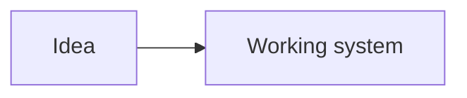

# pblog

[](https://github.com/Link-/pblog/actions/workflows/deploy.yml)

Bassem Dghaidi's collection of notes from experience in software architecture, engineering leadership, developer tools, and public speaking.

The site is built with Jekyll and deployed as static files to the existing server.

## Stack

- Jekyll 4.3 with Markdown posts and Liquid templates
- SCSS compiled by Jekyll
- Vanilla JavaScript for themes, code copying, reading progress, speaking filters, and headshot selection
- Mermaid 11 for diagrams
- Puppeteer for social thumbnail generation
- GitHub Actions for static builds and SSH deployment

## Requirements

- Ruby 3.1.3
- Bundler
- Node.js 24
- npm

## Local setup

Install the Ruby and Node.js dependencies:

```bash
bundle install
npm ci --prefix script
```

Start the local site with drafts and live reload:

```bash
make serve
```

The site is available at `http://127.0.0.1:4000/`.

Changes to `_config.yml` require restarting the development server.

## Common commands

| Command | Purpose |
| --- | --- |
| `make serve` | Run the local site with drafts and live reload |
| `make build` | Create a production build in `_site/` |
| `make test` | Run Jekyll diagnostics and build the site |
| `make new_post` | Create a dated draft post in `_posts/` |
| `make rename_posts` | Rename `*-untitled.md` posts from their titles |
| `make generate_og_assets` | Generate social thumbnails that are missing |
| `make upgrade` | Update Ruby and Node.js dependencies |
| `make clean` | Remove generated Jekyll output and caches |

Running `make` performs post renaming, missing thumbnail generation, and a production build.

## Writing notes

Published notes live in `_posts/`. Draft material lives in `_drafts/`.

A post requires front matter similar to:

```yaml
---
layout: post
title: "A useful title"
tldr: "A short description used in listings and social previews."
date: 2026-10-04 10:00:00 +0200
categories: software architecture
image: /assets/img/og_assets/2026-10-04-a-useful-title.png
sitemap:
  lastmod: 2026-10-04
  priority: 0.7
  changefreq: monthly
---
```

The post filename controls its permalink and normally follows:

```text
YYYY-MM-DD-title-slug.md
```

### Code blocks

Fenced code blocks are syntax highlighted and receive an accessible copy button automatically:

````markdown
```javascript
console.log("hello");
```
````

### Mermaid diagrams

Use a `mermaid` fenced block:

````markdown

````

Mermaid diagrams receive zoom, reset, scrolling, and fullscreen controls in the browser.

Bare URLs in prose are made clickable automatically. URLs inside code blocks and existing links are left unchanged.

## Public speaking

Speaking appearances are stored in `_data/talks.yml` and rendered by `_layouts/speaking.html`.

Each appearance supports:

```yaml
- title: "Talk title"
  event: "Event or show"
  type: "Tech Talk"
  date: "Oct 4, 2026"
  iso_date: "2026-10-04"
  url: "https://example.com/watch"
  slides: "/assets/static/example-slides.pdf"
```

Set `featured: true` and provide `thumbnail` and `description` fields to display an appearance in the featured section.

The About page includes the biography and three selectable headshots from `assets/img/bio/`. The selected image controls the download link shown to visitors.

## Courses

Courses are stored in `_data/courses.yml` and rendered at `/courses/` by `_layouts/courses.html`.

Each course includes its provider, format, access model, source URL, locally stored artwork, description, and topic labels. Set `featured: true` to display a course in the larger featured position.

## Social thumbnails

The generator reads post front matter, calculates reading time, and creates 1200 by 630 PNG images in `assets/img/og_assets/`.

Generate only missing thumbnails:

```bash
npm run generate --prefix script
```

Regenerate every thumbnail after changing `og_templates/template.html`:

```bash
npm run generate:all --prefix script
```

If a post has no `image` value, or its value is `tbd`, the generator adds the standard image path to its front matter. Existing custom image paths are respected.

Generation fails when required metadata is missing, rendering fails, or the title and description overlap the template footer.

## Deployment

`.github/workflows/deploy.yml` runs for relevant changes pushed to `main` and can also be started manually.

The workflow:

1. Installs Node.js dependencies and restores the Puppeteer browser cache.
2. Generates social thumbnails that do not exist.
3. Installs Ruby dependencies.
4. Builds the static site into `_site/`.
5. Synchronizes `_site/` to the existing server over SSH.

Deployment requires these GitHub environment secrets:

- `PRIVATE_KEY`
- `REMOTE_HOST`
- `REMOTE_USER`
- `REMOTE_DEPLOY_PATH`
- `REMOTE_PORT`

The remote server only receives the generated static contents of `_site/`.

## Project structure

| Path | Purpose |
| --- | --- |
| `_posts/` | Published notes |
| `_drafts/` | Unpublished notes |
| `_layouts/` | Page, post, home, and speaking templates |
| `_includes/` | Shared HTML fragments |
| `_data/talks.yml` | Structured speaking archive |
| `_data/courses.yml` | Structured course catalog |
| `_sass/` | Syntax highlighting styles |
| `assets/css/` | Main site stylesheet |
| `assets/js/site.js` | Client-side interactions |
| `assets/img/og_assets/` | Generated social thumbnails |
| `og_templates/template.html` | Social thumbnail template |
| `script/` | Post and thumbnail automation |
| `.github/workflows/deploy.yml` | Production build and deployment |
