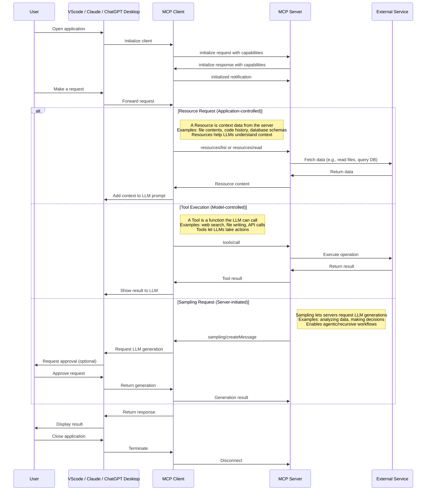
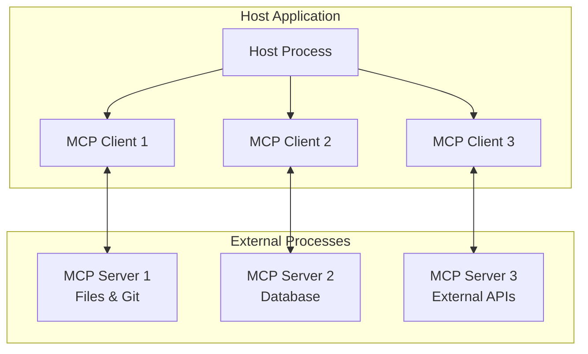

The Model Context Protocol (MCP) enables seamless communication between AI applications (clients) and external data sources or tools (servers). Here's a simple sequence diagram showing how MCP servers work:

## MCP Client - Server Interactions

## Why MCP Servers Are Needed

MCP servers are essential components in the Model Context Protocol architecture for several important reasons:

## Separation of Concerns

The client-server architecture in MCP follows a key design principle: separation of concerns.

Why Not Have the Client Do Everything?

1. **Security Boundaries**:
   - Servers maintain security isolation between different systems
   - Each server has limited access to only what it needs
   - The client doesn't need credentials for every possible system

2. **Simplicity and Maintainability**:
   - Each server can focus on one specific domain (files, databases, etc.)
   - Easier to build, test, and maintain focused servers
   - Modular approach allows servers to be developed independently

3. **Domain Specialization**:
   - Servers can be built by domain experts (database specialists, etc.)
   - Each server can implement specialized functionality for its domain
   - Optimized implementations for different use cases

4. **Distribution and Scaling**:
   - Servers can run locally or remotely, wherever makes most sense
   - Some servers might run close to data sources for performance
   - Allows scaling different components independently

5. **Adaptability**:
   - New servers can be added without changing client implementation
   - Existing servers can be improved independently
   - Encourages ecosystem growth and specialization

6. **User Control**:
   - Users can choose which servers to connect to
   - Different security policies can be applied to different servers
   - Enables granular permission management

## My short explanation of the sequence diagram

<blockquote class="tiktok-embed" cite="https://www.tiktok.com/@glich.stream/video/7492477119877041430" data-video-id="7492477119877041430" style="max-width: 605px;min-width: 325px;" > <section> <a target="_blank" title="@glich.stream" href="https://www.tiktok.com/@glich.stream?refer=embed">@glich.stream</a> How MCP clients&#47;servers work. This is a sequence diagram breaking down the types of exchanges that occur between an mcp client, server and external service allowing the large language models to control the behaviour of that service or fetch &#47; store information from it</section> </blockquote> 
